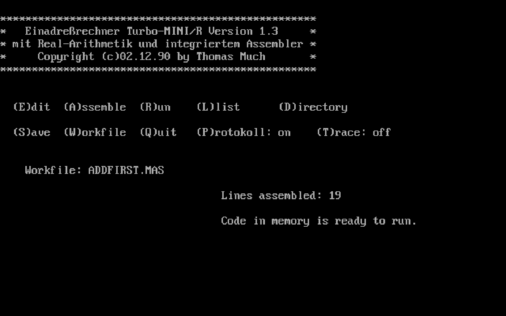
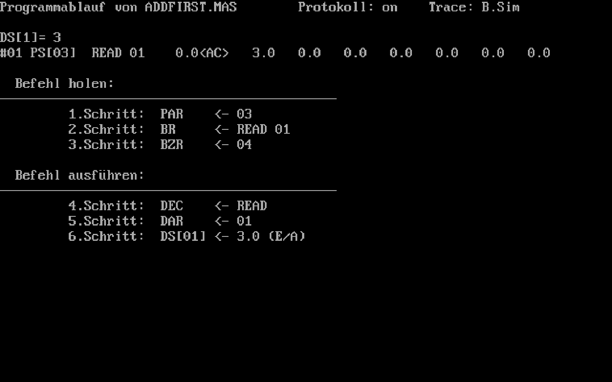

# MINI/R

During graduating class in my last academic high school year 1990/91 some of us computer nerds took part
in a project group called "Informatik AG". Informatics / computer sciences wasn't a regular school subject
back then, especially not at a classical language high school.

So, some motivated physics or mathematics teacher would try new and cool stuff together with us.
On [CP/M](https://en.wikipedia.org/wiki/CP/M) machines first, and in later years on ultra-modern and
lightning-fast [386](https://en.wikipedia.org/wiki/Intel_80386) PCs. On both system types we usually
coded in [Turbo Pascal](https://en.wikipedia.org/wiki/Turbo_Pascal) 3.0.

One of our more theoretical tasks was to understand how assembler, machine code and CPUs worked.
For that purpose we got the description of an [accumulator machine](https://en.wikipedia.org/wiki/Accumulator_(computing)#Accumulator_machines)
([1-operand machine](https://en.wikipedia.org/wiki/Instruction_set_architecture#Number_of_operands))
called "Mini", with a stripped-down instruction set for educational purposes.

We were to solve small algorithms in Mini assembler, convert them to machine code and even decode the
microcode instructions. **All by hand, on paper**. As I had already written some assembler and machine
code for 68008 and 68000 machines, I considered this not to be an option. And so I wrote an assembler
and a simulation for the Mini machine code instructions and their microcodes. I called it "MINI/R",
because it supported real numbers ([floating-point arithmetic](https://en.wikipedia.org/wiki/Floating-point_arithmetic))
instead of only integers.

We've come full circle. Because, nowadays, assembler seems like a classical language, doesn't it?
Which perfectly fits a classical language high school ;-)


## Demo & Commands

Go and try [MINI/R here](https://thmuch.github.io/mini-r/)
(running on [js-dos](https://github.com/caiiiycuk/js-dos) &#x1F603;).

On the main screen, you can enter several commands by pressing their first-letter keys:

| Command | Description |
|---------|-------------|
| (**D**)irectory | Lists all the files in the current directory. If you enter ```*.MAS``` as file mask, you'll see all the provided demo **M**ini **as**sembler files that you can load using the **W**orkfile command.  |
| (**W**)orkfile | Names the current workfile. If the file already exists, it is loaded into memory. |
| (**E**)dit | Lets you edit the current workfile. If you haven't already named the current workfile, you'll be first asked doing so. If the workfile does not exist yet, you can write a new program under that name (that will be created when using the **S**ave command). |
| (**S**)ave | Saves the workfile to the current directory. |
| (**A**)ssemble | Compiles the assembler instructions to machine code. After some commands, MINI/R will automatically assemble the current workfile. |
| (**R**)un | Runs the current workfile (i.e. asks for your input and prints the result to screen). |
| (**T**)race | Now, this is the really cool command. When tracing is ```off``` (default), running the program will simply print the result to screen. If it is ```on``` it will also print the currently executed instructions and the values in the registers. If it is set to ```B.Sim``` it will additionally show how the machine instructions are executed within the processor, that is it simulates some kind of microcode. |
| (**P**)rotokoll | If ```on```, writes the executed machine code instructions and traces to ```lst```, which usually means printing it. Default is ```off```. |
| (**L**)list | Writes the assembler listing to ```lst```, which usually means printing it. |
| (**Q**)uit | Exit application and return to DOS. |


## Disclaimer

This source code is completely out of date. It is provided as-is without any warranty.

I publish the source files for historical / archaeological reasons only, for informational purposes.
The code is not intended to be used any more, especially not as a template for new code.


## Please note

I haven't found the original Mini specification any more. So if you need some documentation of the
assembler commands, you'd probably have to reverse-engineer the Pascal [source code](source/MINI.PAS).

But who knows, maybe some teacher of the 1980s or 90s still has his or her old records at hand and can
create a pull request to enhance the documentation? :-)

Anyway: Have fun!

Thomas\
@thmuch


## Screenshots




